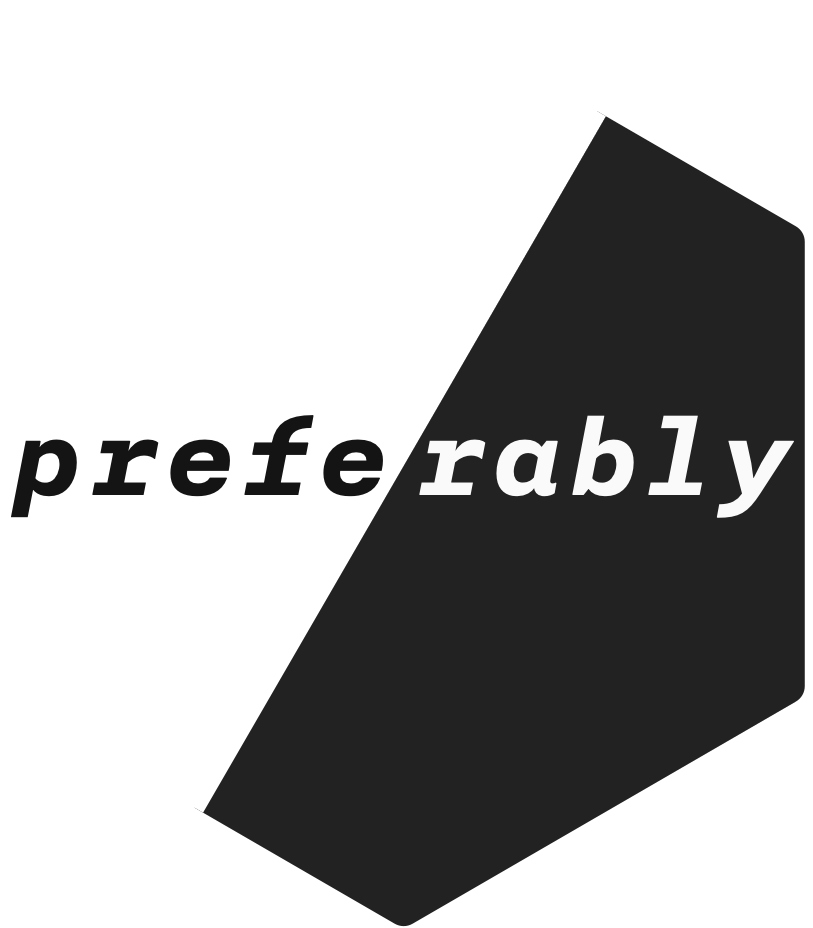
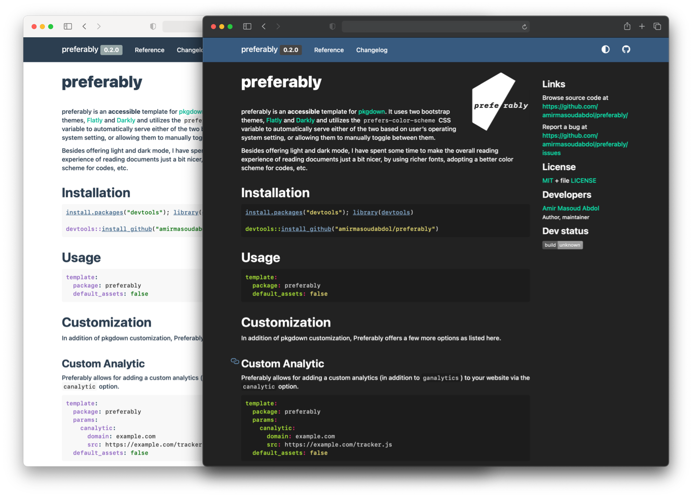

# preferably 

{preferably} is an **accessible** template for [pkgdown](https://pkgdown.r-lib.org/) documentation websites. It uses a [light](https://bootswatch.com/flatly/) and a [dark](https://bootswatch.com/darkly/) theme and utilizes the [`prefers-color-scheme`](https://developer.mozilla.org/en-US/docs/Web/CSS/@media/prefers-color-scheme) CSS variable to *automatically* serve either of the two based on users' operating system setting, or allowing them to manually toggle between them.

Besides offering light and dark mode, I spent some time making the overall reading experience of 'pkgdown' documentations just a bit nicer, by using richer fonts, adopting a better color scheme for codes, etc. 



> Please let me know if you happen to use my template in your project. I'd like to keep a list of websites that are using 'preferably', see here: [In the Wild](https://preferably.amirmasoudabdol.name/articles/in-the-wild.html)!

## Installation

You can download the stable version from CRAN using `install.packages("preferably")`, or you may download the development version from GitHub as follow:

```R
install.packages("devtools"); library(devtools)

devtools::install_github("amirmasoudabdol/preferably")
```

## Usage

After the successful installation, if you already have your pkgdown setup ready, you only need to specify the `template` parameter as follow. Then, as before, you can build your site using `build_site()` and deploy it manually using `deploy_on_branch()`.

```YAML
template:
  package: preferably
```

##### {pkgdown} 2.0 and Bootstrap 5

{preferably} 0.4 is compatible with {pkgdown} 2.0 and Bootstrap 5. In order to build your website using the Bootstrap 5, your setting should look like this:

```YAML
template:
  package: preferably
  bootstrap: 5
```

> ⚠️ Keep in mind that you should NOT use `default_assets: false` when you change the default template. 'preferably' relies on some of the 'pkgdown' assets and templates.

### Integration

In the case that you are using CI systems to build and deploy your website, you need to make sure that 'preferably' is available on the environment. For [GitHub Action](https://pkgdown.r-lib.org/articles/pkgdown.html?q=github%20action#publishing), add the following line to the "Install dependencies" section of your `.github/workflows/pkgdown.yaml` file:

```YAML
- name: Install dependencies
  run: |
    # ⚠️ leave other commands intact, 
    # and add the following command to the end of the list 👇🏼
    remotes::install_github("amirmasoudabdol/preferably", type = "source")
```

If you are using Travis-CI, add the following line to your `.travis.yml` file:

```YAML
r_github_packages:
  - amirmasoudabdol/preferably
```

## Customization

In addition of pkgdown customization, Preferably offers a few more options as listed here.  

### Custom Analytic

Preferably allows for adding a custom analytic (in addition to `ganalytics`) to your website via the `canalytic` option.

```YAML
template:
  package: preferably
  params:
    canalytic:
      domain: example.com
      src: https://example.com/tracker.js
```

Setting these command will generate the following line in the HTML:

```html
<script async defer data-domain="example.com" src="https://example.com/tracker.js"></script>
```

> `{pkgdown}` 2.0 comes with a [greater list of supported trackers](https://pkgdown.r-lib.org/reference/build_site.html?q=plausi#analytics) that you can use out of the box, including [Plausible](https://plausible.io/).

### Manual Light/Dark Toggle

In addition to the automatic color scheme switching, you can add a switch to the menu bar, e.g, <span class="fas fa-adjust fa"></span>, to allow for manual selection between light and dark themes. This can be done by setting the `toggle` option to `manual`. 

```YAML
template:
  package: preferably
  params:
    toggle: manual
```

Unfortunately, it is not possible to have both the automatic and manual mode at the same time. There is an user experience issue here, and it is almost impossible to deliver a seamless experience without involving the server-side, [here](https://kilianvalkhof.com/2020/design/your-dark-mode-toggle-is-broken/), and [here](https://www.joshwcomeau.com/react/dark-mode/). So, you need to choose whether you like to give your users a manual toggle, or let your website adapts to their system preference.

> ⚠️ In order to remove the toggle button, remove the `toggle` parameter.

- - -

## Misc.

#### Goal

The goal of `preferably` is to improve the accessibility and readability of your documentation websites.

#### Future Plan

My main focus is to keep `preferably` light and compatible with `pkgdown`. Besides, I have a short list of features that I would like to add to template files, and `pkgdown` package. For those, I prefer to prepare a few pull requests and add them to `pkgdown` instead of diverging the `preferably` from its core. Let's see when I get to them! Here is a few:

- Adding support for responsive text sizing
- Improving the appearance of argument lists
- Minimizing the size of default pkgdown templates and assets

#### Contribution

If you found any bugs, or have any suggestions, please feel free to reach out to me, either by opening an [issue](https://github.com/amirmasoudabdol/preferably/issues/) or a pull request, or dropping an email. 

#### Support

If you enjoy using {preferably}, please consider supporting it on [GitHub](https://github.com/sponsors/amirmasoudabdol). You can sponsor me monthly, or make a one-time donation! 🤗